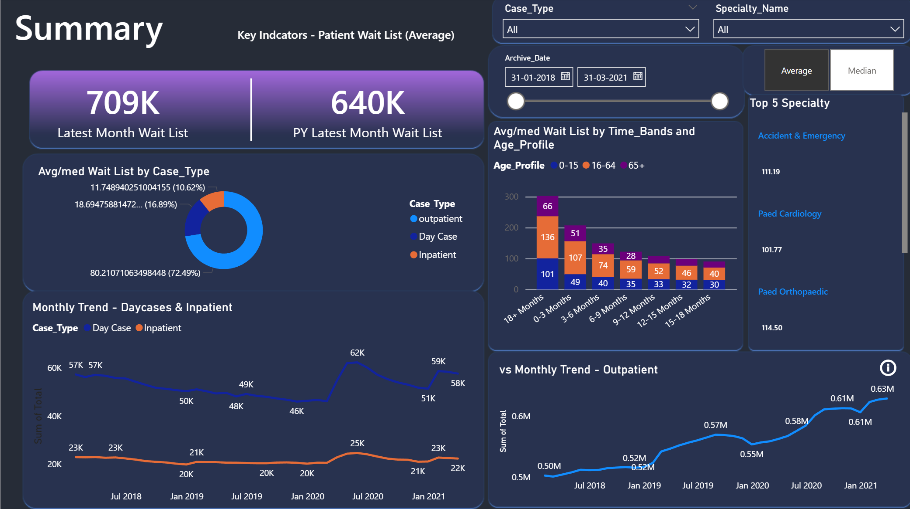
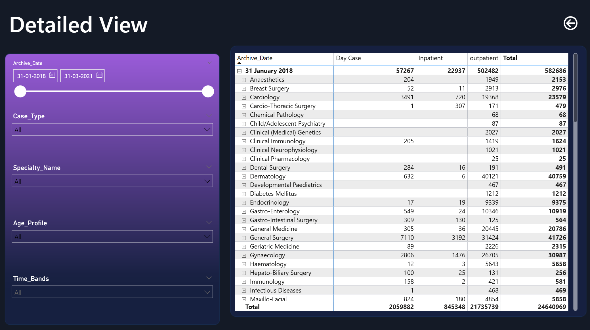

[README.md](https://github.com/user-attachments/files/24123313/README.md)
# 📊 Patient Waiting List Analytics Dashboard (Power BI)



An interactive **Power BI dashboard** designed to analyze patient waiting lists across Inpatient, Day Case, and Outpatient services from **2018–2021**.  
The dashboard provides actionable insights into waiting list trends, specialty-level performance, age profiles, and time-band distributions.

---

## 🎯 Overall Objectives

### **Project Goals**
1. Track the current status of the patient waiting list  
2. Analyze historical monthly trends of waiting lists for Inpatient & Outpatient categories  
3. Provide detailed specialty-level and age-profile analysis  

### **Data Scope**
- **Years Covered:** 2018–2021  
- **Dataset:** NHS waiting list dataset (cleaned & transformed in Power Query)

### **Metrics Required**
- Average & Median Waiting List  
- Current Total Wait List  

### **Views Required**
- Summary Dashboard  
- Detailed Granular View  

---

## 🚀 Project Overview

This dashboard helps answer key operational questions such as:

- How has the waiting list changed over time?  
- Which case types contribute the most to the total wait list?  
- What is the average & median waiting list by specialty?  
- How does patient age profile impact waiting list distribution?  
- Which specialties have the highest overall patient load?  
- How do time bands influence wait patterns (0–3 months, 3–6 months, etc.)?

---

## 🔧 Tech Stack
- Power BI Desktop  
- Power Query  
- DAX  
- Data Modeling (Star Schema)  
- Excel / CSV Dataset  

---


# 🗂️ Dataset Files Included

This project uses multiple datasets to analyze patient waiting list activity across **Inpatient**, **Outpatient**, and **Specialty** categories.  

---

## 📁 1. Inpatient Dataset (4 CSV files)
Location:  
```
/datasets/Inpatient/
```

Fields include:
- Archive_Date  
- Specialty_Name  
- Case_Type  
- Age_Profile  
- Time_Bands  
- Total  

---

## 📁 2. Outpatient Dataset (4 CSV files)
Location:  
```
/datasets/Outpatient/
```

Fields include:
- Specialty  
- Case Type  
- Time Band  
- Age Profile  
- Total  

---

## 📄 3. Mapping_Specialty.csv  
Location:
```
/datasets/Mapping_Specialty.csv
```
Used for specialty name standardization across datasets.


## 📄 Page 1 — Summary View


### **Key Highlights**
- Total Wait List (Latest Month vs Previous Year)  
- Wait List Distribution by Case Type  
- Monthly Trend Analysis for Day Case & Inpatient  
- Age Profile & Time Band Distribution  
- Top 5 Specialties by Average/Median Wait List  
- Interactive slicers for:
  - Case Type  
  - Specialty  
  - Age Profile  
  - Date Range  

---

## 📄 Page 2 — Detailed View



The **Detailed View** page provides a granular breakdown for deeper analysis.

### **Features**
- Multi-level matrix view showing:
  - Case Type counts  
  - Specialty-level drilldown  
  - Total wait list  
- Date range slider for historical comparisons  
- Filters for:
  - Case Type  
  - Specialty Name  
  - Age Profile  
  - Time Bands  
- Expandable rows for specialty-wise exploration  

---

## 🧠 DAX Measures Used

### **Core KPIs**
```
Average Wait List =
AVERAGE(All_Data[Total])

Median Wait List =
MEDIAN(All_Data[Total])
```

### **Dynamic KPI Selection (Average / Median Toggle)**
```
Avg/med Wait List =
SWITCH(
    VALUES('Calculation Method'[Calc Method]),
    "Average", [Average Wait List],
    "Median",  [Median Wait List]
)
```

### **Dynamic Title**
```
Dynamic Title =
SWITCH(
    VALUES('Calculation Method'[Calc Method]),
    "Average", "Key Indicators - Patient Wait List (Average)",
    "Median",  "Key Indicators - Patient Wait List (Median)"
)
```

### **Latest Month KPI**
```
Latest Month Wait List =
CALCULATE(
    SUM(All_Data[Total]),
    All_Data[Archive_Date] = MAX(All_Data[Archive_Date])
) + 0
```

### **Previous Year Comparison**
```
PY Latest Month Wait List =
CALCULATE(
    SUM(All_Data[Total]),
    All_Data[Archive_Date] = EDATE(MAX(All_Data[Archive_Date]), -12)
) + 0
```


---

## 🎯 Purpose of the Project
This project demonstrates complete BI workflow skills, including:

- Data cleaning & transformation  
- Data modeling  
- DAX measure creation  
- Interactive dashboard design  
- Analytical storytelling for healthcare operations  


